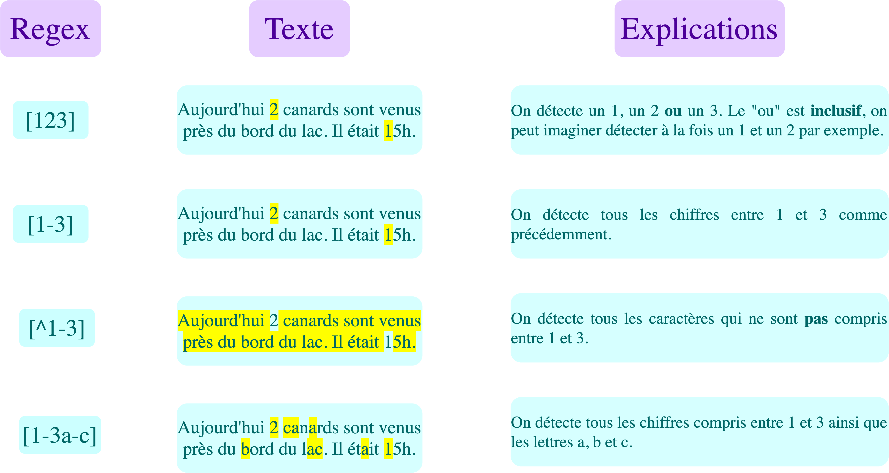
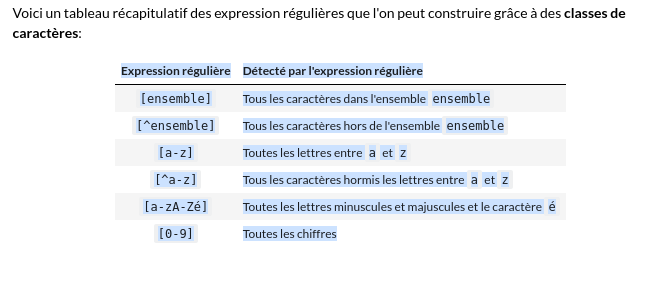

# Introduction to text mining - Regex (Regular Expressions)

## Introduction: Library re

Like in other ML fields, datas have to be preprocessed to be understood by the algorithm later on. In text field, the goal is to **identify regular expressions**. A regex is a string of character following a **pattern**. In python we use the library **re**.

The simplest regex is the string itself, for example if we are looking for all strings "Bonjour" in a text, the associated regex would be "Bonjour".


For optimisations purposes, a regex has to be **compiled** first, and then executed by an engine and detected in a textfile finally.
- The function **compile** compiles the regex. It takes in argument the regex and return an object type **pattern**
_Note_: To specify we are using a raw string we can place a r (like raw string, equivalent of f strgin format I guess) before the regex.
```python
import re
r = re.compile("a") # will search for a in the text.
r = re.compile(r"a")
```

- the functions **findall**, **finditer, search, match** to detect the regex.

findall(), is **applied to the compiled regex** and takes in argument **the text where we are searching the regex**. It returns a list of the words corresponding to the regex.

**Example**: Find nous in a specific sentence

```python

r = re.compile (r"nous") # build the regex and compile it.
txt = 'A la maison, nous avons une télévision. Nous sommes heureux.'
r.findall(txt) # look for the regex in a text

>>> ['nous']
```

**Note**:
1- re library is case sensitive and here it detected only nous and not Nous.
2- We are limited if we have to type every single possibility of regex.

So we will introduce tools to simplify those tasks such as:
- string classes
- quantifier
- metacharacters
- group of capture

Those tools allow to write more compact regex and find more diverse informations.


## String character classes

**String classes are used to represent a group of characters in a concise way**. 

A regex  defining a string class starts and finish by **[]**.

It can be defined in an:
- **extensive** way: we list all the characters to find in a text between [] like [aZ6] to dectect a, Z, or 6.
- **intensive** way: if we want to retrieve a structured sequence, we specify the first and last character with - in the middle. [a-d] to find a,b,c,d.
- **negative** way: to **exclude** characters we place the character **^** before the chracters. [^aZ]] to find everthing except a or Z.
- **union** of classes: **concatenating** character classes like [a-zA-Z] to detect all small and capital letters.

_Example_: 
- Let's define a regex to detect all capital letters.
- Find all in text

```python
r =re.compile(r"[A-Z]")
              
r.findall(txt)
>>>['A','N']
```





