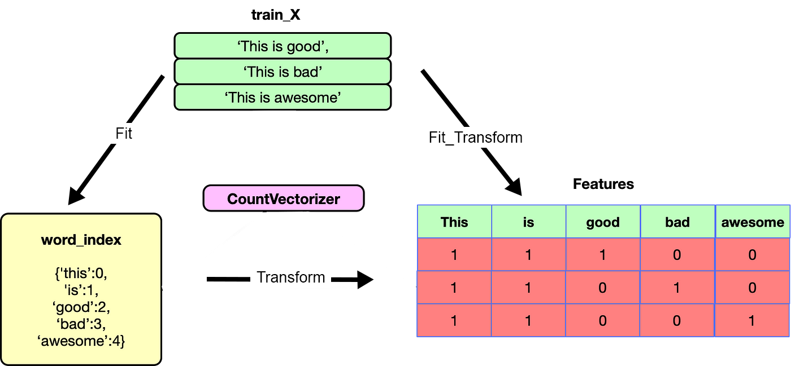

# Preprocessing Text Files

Previously we learn about regex, we will learn now the basics of text mining:
- tokenisation
- Bag of words
- Filter Stop words
- Racinisation
- Lemmatisation

Those techniques are very useful specially for **preprocessing**

## Tokenisation

Tokenisation consists in segment a text in smaller pieces. For example a sentence is tokenized into words. Base units are tokens (words, number, punctuation signs...) and for a same text it is possible to tokenize it in multiple way.

**Scikit-learn** and the tool box **NLTK** (Natural Language ToolKit) are 2 libraries to deal with text analisis.

- Importer la classe PunktSentenceTokenizer du package nltk.tokenize.

- Initialiser tokenizer, une instance de la classe PunktSentenceTokenizer.

- À l'aide de la méthode tokenize de l'objet tokenizer, découper txt en tokens. .


```python
txt = "Souffrez qu'Amour cette nuit vous réveille. Par mes soupirs laissez-vous enflammer. Vous dormez trop, adorable merveille. Car c'est dormir que de ne point aimer."

from nltk.tokenize import PunktSentenceTokenizer

tokenizer = PunktSentenceTokenizer()
tokenizer.tokenize(txt)

>>>["Souffrez qu'Amour cette nuit vous réveille.",
 'Par mes soupirs laissez-vous enflammer.',
 'Vous dormez trop, adorable merveille.',
 "Car c'est dormir que de ne point aimer."]
```

Here we have tokenise a paragraph into sentences. It can be interesting to tokenise into words too.
It can be done with the function **word_tokenize** from the subpackage nltk.tokenize

**word_tokenize(txt,language='_language_of_txt')**

```python


>>>### Insérez votre code ici

from nltk.tokenize import word_tokenize

word_tokenize(txt, language='french')

​```python
### Insérez votre code ici
from nltk.tokenize import word_tokenize
word_tokenize(txt, language='french')

['Souffrez',
 "qu'Amour",
 'cette',
 'nuit',
 'vous',
 'réveille',
 '.',
 'Par',
 'mes',
 'soupirs',
 'laissez-vous',
 'enflammer',
 '.',
 'Vous',
 'dormez',
 'trop',
 ',',
 'adorable',
 'merveille',
 '.',
 'Car',
 "c'est",
 'dormir',
 'que',
 'de',
 'ne',
 'point',
 'aimer',
 '.']

```

## Filter Stop Words

A stop word is a word so common in a language that it is totally useless for analisis.
The list of the stop words of a language can be consulted.

```python
from nltk.corpus import stopwords
stop_words = set(stopwords.words('french')
print(stopwords)

>>>{'fûtes', 'serait', 't', 'étants', 'fussiez', 'eue', 'eussiez', 'sois', 'avez', 'leur', 'avait', 'te', 'eut', 'par', 'aura', 'eusse', 'un', 'serons', 'de', 'ayants', 'aurais', 'étaient', 'sera', 'votre', 'mon', 'ne', 'd', 'été', 'auriez', 'ils', 'ayant', 'étées', 'seraient', 'eu', 'm', 'vous', 'étiez', 'le', 'fusse', 'fussions', 'qui', 'serions', 'la', 'soient', 'ces', 'lui', 'ou', 'fut', 'étant', 'je', 'ayante', 'il', 'c', 'se', 'auraient', 'du', 'toi', 'ta', 'et', 'eussions', 'son', 'fusses', 'avaient', 'des', 'avons', 'eusses', 'notre', 'l', 'on', 'au', 'tu', 'eurent', 'seriez', 'fussent', 'sur', 'étée', 'est', 'eux', 'auras', 'ont', 'pas', 'mais', 'eûtes', 'aux', 'ma', 'ayantes', 'eussent', 'pour', 'y', 'aurez', 'seras', 'moi', 'n', 'avais', 'ayons', 'ait', 'aurait', 'aviez', 'suis', 'vos', 'me', 'avec', 'ce', 'étais', 'elle', 'en', 'seront', 'qu', 'sont', 'eûmes', 'les', 'fûmes', 'était', 'dans', 'soyez', 'aurons', 'aient', 'ton', 'même', 'eues', 'eus', 'aies', 'étantes', 'avions', 'ses', 'serez', 'mes', 'une', 'fus', 'ai', 'aurai', 'sa', 'à', 'j', 'tes', 'étante', 'êtes', 'aie', 'serai', 'soyons', 'as', 'aurions', 'nous', 's', 'sommes', 'auront', 'étions', 'serais', 'eût', 'soit', 'furent', 'étés', 'ayez', 'que', 'fût', 'es', 'nos'}

```

The returned variable is a **set**. it is possible to:
- add a new stop word to the set using _stop_words.add("new_stop_word")_
- add multiple stop wrods to the set using _stop_words.update([word1,word2])_


Let's create a functio to delete the stop_words of a list passed in parameter

```python
#Update the stop_words set
stop_words.update([',','.'])


def stop_words_filtering(list):
    tokens = []
    for mot in list:
        if mot not in stop_words:
            tokens.append(mot)
    return tokens


stop_words_filtering(mots)
>>>
['Souffrez',
 "qu'Amour",
 'cette',
 'nuit',
 'réveille',
 'Par',
 'soupirs',
 'laissez-vous',
 'enflammer',
 'Vous',
 'dormez',
 'trop',
 'adorable',
 'merveille',
 'Car',
 "c'est",
 'dormir',
 'point',
 'aimer']

```

It is better but we still have words like 'laissez-vous', "c'est".

We will use the class **RegexpTokenizer** from nltk.tokenize.regexp to deal with this problematic.
_Example_:

tokenizer = RegexpTokenizer(r'\w+|\$[\d\.]+|\S+')


```python
from nltk.tokenize.regexp import RegexpTokenizer

tokenizer = RegexpTokenizer(r"[a-zé]{4,}")
tokens = tokenizer.tokenize(txt.lower())
tokens

>>>
['souffrez',
 'amour',
 'cette',
 'nuit',
 'vous',
 'réveille',
 'soupirs',
 'laissez',
 'vous',
 'enflammer',
 'vous',
 'dormez',
 'trop',
 'adorable',
 'merveille',
 'dormir',
 'point',
 'aimer']
```

This is useful because it is a custom tokenisation, here we kept tokenized(kept only) the words with 4 or more chracters and filter a specific set of stop_words. 
Usually, stopwrds and tokenisation are previous the bag of words algortihm

## Bag of words (algorithm)

### CountVectorizer

The algorithm Bag of words consist in vectorize a document. The representation in bags of words is represent a document count the number of occurences for each words. It can be used on a string of characters or a file. It gives good results but nowadays bag of words is done by neural networks.

How to use it?
- vectorizer = CountVectorizer()
- tokens = vectorizer.fit_transform(string) to apply the the algo on the string or document
- vectorizer.vocabulary_ to obtains the tokens numerated
- vectorizer.transform(['une nouvelle phrase']).toarray() to display the vector representation of a new phrase.



- Initialiser vectorizer, en utilisant la méthode CountVectorizer.

- Convertir les chaînes de caractères, à l'aide de la méthode fit_transform de l'objet vectorizer, en tokens.

- Récupérer les tokens numérotés.


```python
#Importer le package nécessaire
from sklearn.feature_extraction.text import CountVectorizer

# Créer un vectorisateur
vectorizer = CountVectorizer()

# Appliquer Bag of words à la variable tokens
vectorizer.fit_transform(tokens)

# Récupération des tokens
tokenized = vectorizer.vocabulary_
print(tokenized)

>>> #Importer le package nécessaire

from sklearn.feature_extraction.text import CountVectorizer

​

# Créer un vectorisateur

vectorizer = CountVectorizer()

​

# Appliquer Bag of words à la variable tokens

vectorizer.fit_transform(tokens)

​

# Récupération des tokens

tokenized = vectorizer.vocabulary_

print(tokenized)

​

{'souffrez': 12, 'amour': 2, 'cette': 3, 'nuit': 9, 'vous': 15, 'réveille': 11, 'soupirs': 13, 'laissez': 7, 'enflammer': 6, 'dormez': 4, 'trop': 14, 'adorable': 0, 'merveille': 8, 'dormir': 5, 'point': 10, 'aimer': 1}
```

This representation can be the following, where each word is assgined an index


```python

print(vectorizer.transform(["laissez-vous enflammer","Dormez vous cette nuit ?"]).toarray())

>>> print(vectorizer.transform(["laissez-vous enflammer","Dormez vous cette nuit ?"]).toarray())

​

[[0 0 0 0 0 0 1 1 0 0 0 0 0 0 0 1]
 [0 0 0 1 1 0 0 0 0 1 0 0 0 0 0 1]]

```

Those arrays means, 0 the word is not present in our   indexed result and 1 it is. So we see the first phrase has one word which is the 7th indexed in our vecotizer which is Laissez and the 16th is vous and the 6th is enflammer. So we know we have enflammer, laissez and vous. but we dont know the order.


```python
print(vectorizer.transform(["Dormez vous vous cette nuit ?"]).toarray())

[[0 0 0 1 1 0 0 0 0 1 0 0 0 0 0 2]]
```
This shows that this function returns the **frequence** of each words!!!.

## TF-IDF
While CountVectorizer is focus only on the raw frequency of the words, **TF-IDF** introduces a notion of weight taking in count the frequency and the rarity  in the whole corpus. The **TF-IDF can be defined as the product of 2 scores measuring the importance of a word in a text.

**TF-IDF**(i,j) = **TF**(i,j)x **IDF**(i)
- TF: Term Frequency, the score represents the frequency of appearence of a word in a sentence.
- IDF: Inverse Document Frequency, the score reprensents the specificity of a word in the corpus of a texts.

This method is implemented by the class **tfidfVectorizer** from the package **sklearn.feature_extraction.text and implement the formula above.
How to use it:
```python
# Initialize the vectorizer
vectorizer = TfidfVectorizer()

# Apply the numerating algorithm
tokens = vectorizer.fit_transform(string)

# Retrieve the tokens_numbered
vectorizer.vocabulary_

# to display the vectorial representation of a new phrase
vectorizer.transform(['une nouvelle phrase']).to_array()
```
