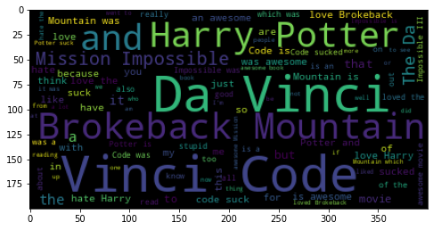

# Word_Cloud

# Data Preparation

We will use the techniques we saw previously to create a word cloud. We need to calculate the frequency of the word of a corpus. We will use **pandas**, **NLTK**, **wordlcoud**.
The data set here are comments from movie reviewers.

```python
import pandas as pd
df = pd.read_csv('movies_comments.csv')
df.head()
df.shape
>>>
                                                Text  Sentiment
0   Brokeback Mountain'is so beautiful, and so am...          1
1   I liked Harry Potter and I'll be sorry to see...          1
2                  The Da Vinci Code'it was AWESOME.          1
3                   and i love brokeback mountain...          1
4                     but I LOVE brokeback mountain.          1
Taille du dataset : (1371, 2)


```

We see the df has 2 columns:
- text
- Sentiment


Let's compile/put all together the comments.
```python
text = ""
for comment in df.Text : 
    text += comment

# Importer stopwords de la classe nltk.corpus
from nltk.corpus import stopwords

# Initialiser la variable des mots vides
stop_words = set(stopwords.words('english'))
print(stop_words)

```


# Wordcloud Library

The library wordCloud implements an algortihm  to display a wordcloud of a text.
Steps:
- Tokenise the text passed in parameter.
- filter the stopwords
- calculate the frequency of the words
- Visual rep of keywords, with highest frequency with a cloud shape

The method WordCloud has multiple parameters:
- background_color
- max_words
- stopwords is a string to specify the words to filter from the corpus.

To generate a wordclopud we nee to define a calque with WordCloud and fro there use generate.
```python
wc = WordCloud()
wc.generate(corpus)
```


```python
#Importer les packages nécessaires
from wordcloud import WordCloud
import matplotlib.pyplot as plt
%matplotlib inline

# Définir le calque du nuage des mots
wc = WordCloud(background_color="black", max_words=100, stopwords=stop_words, max_font_size=50, random_state=42)

import matplotlib.pyplot as plt 

# Générer et afficher le nuage de mots

plt.figure(figsize= (8,6)) # Initialisation d'une figure
wc.generate(text)           # "Calcul" du wordcloud from text we did at the beginning.
plt.imshow(wc) # Affichage
plt.show()





## Give a shape to the cloud

It is possible to apply a mask on the wordcloud so it can have a cloud shape.


```python
#Importer les packages nécessaires
from PIL import Image
import numpy as np

def plot_word_cloud(text, masque, background_color = "black") :
    # Définir un masque
    mask_coloring = np.array(Image.open(str(masque)))

    # Définir le calque du nuage des mots
    wc = WordCloud(width=800, height=400, background_color=background_color, max_words=200, stopwords=stop_words, mask = mask_coloring, max_font_size=70, random_state=42)

    # Générer et afficher le nuage de mots
    plt.figure(figsize= (10,5))
    wc.generate(text)
    plt.imshow(wc)
    plt.show()

plot_word_cloud(text, "iron.jpg")

# Code d'affichage du masque
import matplotlib.image as mpimg
img = mpimg.imread("iron.jpg")
plt.imshow(img)
plt.show()
```


