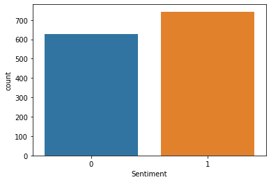

# Sentiment Analysis

The goal is to develop a ML algorithm to perform a sentiment analysis after creating a corpus, and prepare it (preprocessing) and transform it in matrix terms-document.
Movies_comments.csv has 2 columns.
- Text for the comments
- Sentiment for the sentiments 1 being positive and 0 negative.

We will use this dataset ot build an alogrithm which will be able later to ddetermine positive or negative sentiment on any new phrases.


## Count Vectorizer

```python
import pandas as pd

from sklearn.feature_extraction.text import CountVectorizer, TfidfVectorizer
from sklearn.ensemble import GradientBoostingClassifier

df = pd.read_csv('movies_comments.csv')
df.head(2)

Text 	Sentiment
0 	Brokeback Mountain'is so beautiful, and so am... 	1
1 	I liked Harry Potter and I'll be sorry to see... 	1

```

- Check if the dataset is balanced

We will use **countplot** from seaborn

```python
import seaborn as sns
sns.countplot(x=df['Sentiment'])
```


