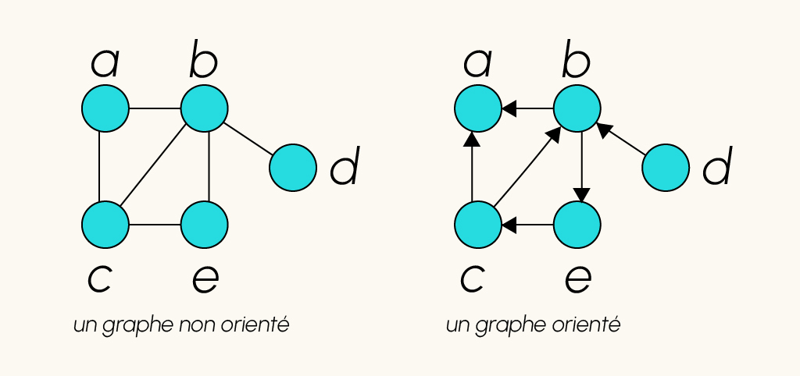
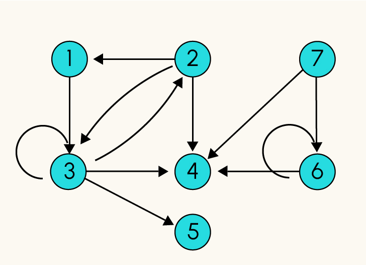

# Introduction to Graphs

Graphs theory is between mathematics and CS. This field study relationships and structures usings networks of nodes interconnected.

We will see here how to:
- understand vocabulary and structures of graphs.
- Handle the libray NetworkX, to create, visualise and analyse graphs.
- Discover the main algorithm of graphs theory.
- Detect communities using the algo PageRank.

# What is a graph?

A graph is a structure made of nodes and tensors/spines. Nodes represents entities and tensors the relationship between those nodes. Graphs can represent social noetwork or transport networks.

The theory of graphs is useful to solve problems such as:
- what is the shortest path between 2 specific nodes? 
- Is a graph connected? aka is it possible to go from any  node to another random node?

Some real case use are:
- establish the best route for a commercial worker?
- How to place infrastructure in an optimal way?
- How to attribute class rooms to learners without overlaying?


## Types of graphs

- Non-Oriented graphs: Tensors are not oriented. If there is a tensor between A and B, it means A is connected to B AND B is connected to A.
- Oriented graphs: Tensors are oriented. This means A is connected to B but B is not connected to A. Sometimes tensors can have weights representing the force of the relation, distance and cost...




From a mathematical pov, we can define a graph G as:
- A certain number of nodes (S).
- A certain number of couples of Nodes called Tensors (A).




- S = {1,2,3,4,5,6,7}
- A = {(1,3),((2,1),(2,4),(2,3),(3,2),(3,3),(3,4),(3,5),(6,4),(6,6),(7,6)}.

(6,6), (3,3) are called loops.


# First step with NetworkX

NetworkX can 
- create
- delete
- modify a graph in term of node or Tensor.
- Has the main algorithm for the graphs theory


```python
import networkx as ns
import matplotlib.pyplot as plt
import pandas as pd

df = pd.read_csv('edgelist.csv', index_col = 0)
df.head()

 	source 	target
0 	0 	    1
1 	0 	    2
2 	0 	    3
3 	0 	    4
4 	0 	    5
  ```

This df is a list of tensors/aretes. Each line is a tensor connecting the node source to the node target. We can convert this df into a graph.

We will explain later all this code.

```python
G = nx.from_pandas_edgelist(df) # création du graphe à partir de df
nx.draw_networkx(G,font_color="white") # affichage du graphe

plt.show()
```


We can see
- 12 nodes (0-11).
- From the node 0 there are 11 tensors.
- From the node 1, there 11 tensors too, but one is coming from the node 0, so we don't have to count it twice. We have then, 11+10+...+1 in this graph -> 66 tensors.


# Creating a Graph

```python
G1 = nx.Graph() # Non oriented Graph
G2 = nx.DiGraph() # Directed Graph

```

# Add a node to a Graph.

We just created a graph. So we need fill it now.
A node can be any hashable object. It can be a string, a numerical value, an image, a function, another graph...

We can use :
- **G.add_node(n,attr)**:to **add** an unique node n to the Graph G. It has an optional argument _attr_ representing a collection of attributes in a key/value format. Usually it is used, color, label, style, but we can use custom attr.
```python
G.add_node(1, name='Daniel', role= 'Support')
```
- **G.add_nodes_from(nodes,attr)**: to add several nodes simultaneously to the graph G. The argument _attr_ is applied to all nodes.
  ```python
  G.add_nodes_from([2,3],role='mentor')
  ```

- **nx.path_graph(n)**: to generate a graph with a shape of path composed of n nodes. Nodes are numbered sequentially from 0 to n-1 and are connected by the tensors. If we want to retrieve the nodes of this path we use as before the method **add_nodes__from()**. If tensors have to be kept, the method **nx.compose(G,path)** combines the path with the graph G fusionning the nodes and the tensors.

'''python 
chemin = nx.path_graph(10) # Create a path of 10 nodes
G = nx.compose(G, chemin) # fuse chemin and G
'''

_Note_: It is possible to retrieve the list of neighbour nodes of a specific nodes n, using **list(G.adj[n])**

- 

