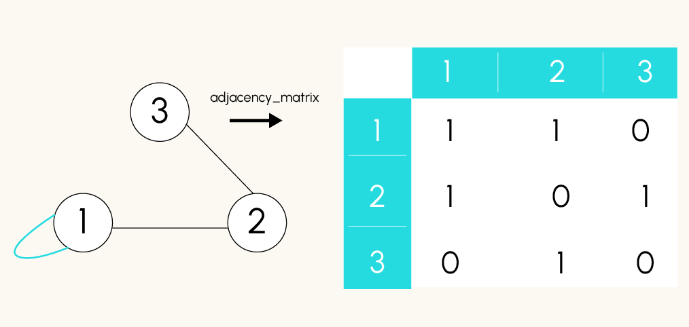
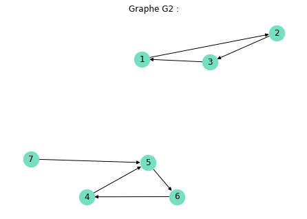

# Algortihms


# Graphs representations
We saw previously how to visualize graphs. But we have to understand what is behind it. 

It exists 2 main structures:
- adjacence list
- adjacence matrix

## Adjacence Lists
Here each nodes is associated to a list of it neighboors. In other words, for each node (i), there is a list containing all the nodes directly connected to i by an edge.
> This is great for low complex graphs, because it is only stored connected nodes. It is more memory efficient.


```python
# Retrieve the adjacence list of a Graph G
adj_list = nx.to_dict_of_lists(G)
print(adj_list)

```


## Adjacence Matrix



This is a matrix representations of a graph in a squared matrix of n x n dimension with n is the number of nodes. Each cells  is the intersection of the ligne i and column j contains a 1 if there is an edge between node i and node j. This matrix is symetrical for a non oriented graph.
> This method is great for dense graphs because we can use matricial operations to work on the graph.

Networkx has a method to obtain this matrix -> **nx.adjency_matrix(G)**. Because this a csr_matrix type object, we need to use todense() on it to retrieve the matricial representation of the object created by networkx.`

```python
A = nx.adjency_matrix(G)
A.todense() # to visualise it
```


> Remarque : Le type gml (Graph Modelling Language) est un format de fichier pour stocker des graphes.
>
> On lit un fichier gml avec NetworkX en uilisant la méthode read_gml() et on enregistre un graphe au format gml avec NetworkX en utilisant la méthode write_gml().
>
> Remarque 2 : Le graphe G1 du premier notebook a été enregistré sous le nom g1.gml. Vous pouvez ainsi l'importer.


```python
import networkx as nx

# Import du graphe G1 du précédent notebook
G1 = nx.read_gml("g1.gml")

# Calculer la matrice d'adjacence du graphe G1
A = nx.adjacency_matrix(G1)

# Convertir et afficher la matrice d'adjacence du graphe G1. La matric est bien symétrique
print("Matrice d'adjacence : \n",A.todense(),"\n")

# Calculer la liste d'adjacence et on l'affiche.
adj_list_from_graph = nx.to_dict_of_lists(G1)
print("Liste d'adjacence : \n",adj_list_from_graph)

>>> Matrice d'adjacence : 
 [[0 1 0 0 0 0 0 0 0 1 0 0 0]
 [1 0 1 0 0 0 0 0 0 0 0 0 0]
 [0 1 0 0 0 0 0 0 0 0 1 0 0]
 [0 0 0 0 0 0 0 0 0 0 1 0 0]
 [0 0 0 0 0 0 0 0 0 0 0 0 0]
 [0 0 0 0 0 0 0 0 0 0 0 0 0]
 [0 0 0 0 0 0 0 0 0 0 0 1 0]
 [0 0 0 0 0 0 0 0 1 1 0 0 1]
 [0 0 0 0 0 0 0 1 0 1 0 0 0]
 [1 0 0 0 0 0 0 1 1 0 0 0 0]
 [0 0 1 1 0 0 0 0 0 0 0 0 0]
 [0 0 0 0 0 0 1 0 0 0 0 0 1]
 [0 0 0 0 0 0 0 1 0 0 0 1 0]] 

Liste d'adjacence : 
 {'0': ['1', '12'], '1': ['0', '2'], '2': ['1', '3'], '4': ['3'], '5': [], '6': [], '7': ['8'], '10': ['9', '11', '12'], '11': ['10', '12'], '12': ['0', '10', '11'], '3': ['2', '4'], '8': ['7', '9'], '9': ['10', '8']}

```

## More Definitions
### Connexity of a graph.

A **non-oriented graph is connex** if we can join any nodes by a path -> a connexed graph is like **a block**.

- Connexity of a composant.

A connexed composant is a connexed sub-graph. In **oriented graph** we have to more concepts:
- Highly connexed composants: A composant is highly connezed if we can go for **each pair of nodes of this composant following the directions of the edges**.
  
  
- Poorly connexed composants: If we transformed the oriented graph to non oriented graph, the poorly connexed composants would become connexed.

```python
highly_connexed = list(nx.strongly_connected_components(G))

poorly_connexed = list(nx.weakly_connected_components(G))

```


_Example_

```python
import matplotlib.pyplot as plt

# Visualisation du graphe G1
pos = nx.spring_layout(G1)
nx.draw(G1,pos, with_labels=True, font_color='black', node_size=500, node_color='#75DFC1') 
plt.title("Graphe G1 :")
plt.show()

# Connexité de G1
print("Le graphe G1 est connexe." if nx.is_connected(G1) else "Le graphe G1 n'est pas connexe.")
# G1 n'est pas connexe car les noeuds 5 et 6 sont isolés.  

# Création et affichage de G2
G2 = nx.DiGraph([(1, 2), (2, 3), (3, 1), (4, 5), (5, 6), (6, 4), (7, 5)]) #graphe orienté
pos = nx.spring_layout(G2)
nx.draw(G2,pos, with_labels=True, font_color='black', node_size=500, node_color='#75DFC1') 
plt.title("Graphe G2 :")
plt.show()

# Composantes fortement connexes de G2
composantes_fortement_connexes = list(nx.strongly_connected_components(G2))
print("Les composantes fortements connexes de G2 sont : ", composantes_fortement_connexes)

# Composantes faiblement connexes de G2
composantes_faiblement_connexes = list(nx.weakly_connected_components(G2))
print("Les composantes faiblement connexes de G2 sont : ", composantes_faiblement_connexes)

>>>Les composantes fortements connexes de G2 sont :  [{1, 2, 3}, {4, 5, 6}, {7}]
Les composantes faiblement connexes de G2 sont :  [{1, 2, 3}, {4, 5, 6, 7}]
```



### Cycle, Tree, Forest

- A cycle is a suit of consecutive edges (path) starting on one node and coming back to it without going through twice antoher node. To find all the cycles of a graph we use **list(nx.simple_cycles(G))**.
```python
list(nx.simple_cycles(G2))

>>>[[4, 5, 6], [1, 2, 3]]
```

- a Tree is a **connexed graph without any cycle**.
  For a graph G connex with n nodes, G is a tree if only G has n-1 edges. To verify if G is a tree
