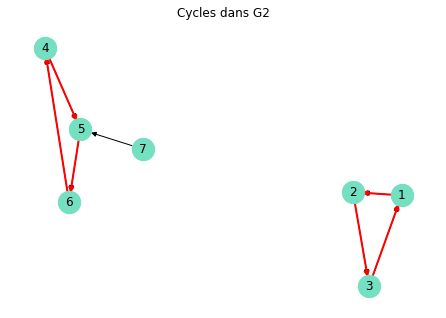
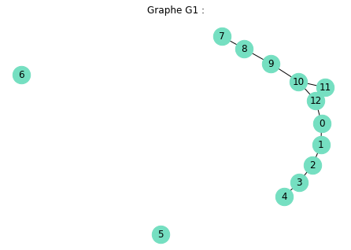

# Algorithms


# Graphs representations
We saw previously how to visualize graphs. But we have to understand what is behind it. 

It exists 2 main structures:
- adjacence list
- adjacence matrix

## Adjacence Lists
Here each nodes is associated to a list of it neighboors. In other words, for each node (i), there is a list containing all the nodes directly connected to i by an edge.
> This is great for low complex graphs, because it is only stored connected nodes. It is more memory efficient.


```python
# Retrieve the adjacence list of a Graph G
adj_list = nx.to_dict_of_lists(G)
print(adj_list)

```


## Adjacence Matrix


This is a matrix representations of a graph in a squared matrix of n x n dimension with n is the number of nodes. Each cells  is the intersection of the ligne i and column j contains a 1 if there is an edge between node i and node j. This matrix is symetrical for a non oriented graph.
> This method is great for dense graphs because we can use matricial operations to work on the graph.

Networkx has a method to obtain this matrix -> **nx.adjency_matrix(G)**. Because this a csr_matrix type object, we need to use todense() on it to retrieve the matricial representation of the object created by networkx.`

```python
A = nx.adjency_matrix(G)
A.todense() # to visualise it
```


> Remarque : Le type gml (Graph Modelling Language) est un format de fichier pour stocker des graphes.
>
> On lit un fichier gml avec NetworkX en uilisant la méthode read_gml() et on enregistre un graphe au format gml avec NetworkX en utilisant la méthode write_gml().
>
> Remarque 2 : Le graphe G1 du premier notebook a été enregistré sous le nom g1.gml. Vous pouvez ainsi l'importer.


```python
import networkx as nx

# Import du graphe G1 du précédent notebook
G1 = nx.read_gml("g1.gml")

# Calculer la matrice d'adjacence du graphe G1
A = nx.adjacency_matrix(G1)

# Convertir et afficher la matrice d'adjacence du graphe G1. La matric est bien symétrique
print("Matrice d'adjacence : \n",A.todense(),"\n")

# Calculer la liste d'adjacence et on l'affiche.
adj_list_from_graph = nx.to_dict_of_lists(G1)
print("Liste d'adjacence : \n",adj_list_from_graph)

>>> Matrice d'adjacence : 
 [[0 1 0 0 0 0 0 0 0 1 0 0 0]
 [1 0 1 0 0 0 0 0 0 0 0 0 0]
 [0 1 0 0 0 0 0 0 0 0 1 0 0]
 [0 0 0 0 0 0 0 0 0 0 1 0 0]
 [0 0 0 0 0 0 0 0 0 0 0 0 0]
 [0 0 0 0 0 0 0 0 0 0 0 0 0]
 [0 0 0 0 0 0 0 0 0 0 0 1 0]
 [0 0 0 0 0 0 0 0 1 1 0 0 1]
 [0 0 0 0 0 0 0 1 0 1 0 0 0]
 [1 0 0 0 0 0 0 1 1 0 0 0 0]
 [0 0 1 1 0 0 0 0 0 0 0 0 0]
 [0 0 0 0 0 0 1 0 0 0 0 0 1]
 [0 0 0 0 0 0 0 1 0 0 0 1 0]] 

Liste d'adjacence : 
 {'0': ['1', '12'], '1': ['0', '2'], '2': ['1', '3'], '4': ['3'], '5': [], '6': [], '7': ['8'], '10': ['9', '11', '12'], '11': ['10', '12'], '12': ['0', '10', '11'], '3': ['2', '4'], '8': ['7', '9'], '9': ['10', '8']}

```

## More Definitions
### Connexity of a graph.

A **non-oriented graph is connex** if we can join any nodes by a path -> a connexed graph is like **a block**.

- Connexity of a composant.

A connexed composant is a connexed sub-graph. In **oriented graph** we have to more concepts:
- Highly connexed composants: A composant is highly connezed if we can go for **each pair of nodes of this composant following the directions of the edges**.
  
  
- Poorly connexed composants: If we transformed the oriented graph to non oriented graph, the poorly connexed composants would become connexed.

```python
highly_connexed = list(nx.strongly_connected_components(G))

poorly_connexed = list(nx.weakly_connected_components(G))

```


_Example_

```python
import matplotlib.pyplot as plt

# Visualisation du graphe G1
pos = nx.spring_layout(G1)
nx.draw(G1,pos, with_labels=True, font_color='black', node_size=500, node_color='#75DFC1') 
plt.title("Graphe G1 :")
plt.show()

# Connexité de G1
print("Le graphe G1 est connexe." if nx.is_connected(G1) else "Le graphe G1 n'est pas connexe.")
# G1 n'est pas connexe car les noeuds 5 et 6 sont isolés.  

# Création et affichage de G2
G2 = nx.DiGraph([(1, 2), (2, 3), (3, 1), (4, 5), (5, 6), (6, 4), (7, 5)]) #graphe orienté
pos = nx.spring_layout(G2)
nx.draw(G2,pos, with_labels=True, font_color='black', node_size=500, node_color='#75DFC1') 
plt.title("Graphe G2 :")
plt.show()

# Composantes fortement connexes de G2
composantes_fortement_connexes = list(nx.strongly_connected_components(G2))
print("Les composantes fortements connexes de G2 sont : ", composantes_fortement_connexes)

# Composantes faiblement connexes de G2
composantes_faiblement_connexes = list(nx.weakly_connected_components(G2))
print("Les composantes faiblement connexes de G2 sont : ", composantes_faiblement_connexes)

>>>Les composantes fortements connexes de G2 sont :  [{1, 2, 3}, {4, 5, 6}, {7}]
Les composantes faiblement connexes de G2 sont :  [{1, 2, 3}, {4, 5, 6, 7}]
```


### Cycle, Tree, Forest

- A cycle is a suit of consecutive edges (path) starting on one node and coming back to it without going through twice antoher node. To find all the cycles of a graph we use **list(nx.simple_cycles(G))**.
```python
list(nx.simple_cycles(G2))

>>>[[4, 5, 6], [1, 2, 3]]
```

- a Tree is a **connexed graph without any cycle**.
  For a graph G connex with n nodes, G is a tree if only G has n-1 edges. To verify if G is a tree we use the method **nx.is_tree(G)**.

- A forest is a graph **without any cycle**, and can be considered as a group of trees. To check if a graph G is a forest, we can use the method nx.is_forest(G).

_Example_:
- Determine if G2 is has one or more cycles.
- Is G2 a tree? If not identify the list of edges of the forests.

```python
# cycles in G2
list(nx.simple_cycles(G2))
>>> [[4, 5, 6], [1, 2, 3]]

# Visualize the cycles
pos = nx.spring_layout(G2)
nx.draw(G2, pos, with_labels=True, font_color='black', node_size=500, node_color='#75DFC1')
plt.title("Cycles dans G2")
for cycle in cycles:
    nx.draw_networkx_edges(G2, pos, edgelist=[(cycle[i], cycle[i+1]) for i in range(len(cycle)-1)], edge_color='red', width=2)
    nx.draw_networkx_edges(G2, pos, edgelist=[(cycle[-1], cycle[0])], edge_color='red', width=2)
plt.show()

# Arbre
print("G2 est un arbre." if nx.is_tree(G2) else "G2 n'est pas un arbre.") # G2 n'est pas un arbre car il contient des cycles. 

# Forêt 
forests = list(nx.weakly_connected_components(G2))
print("Forêts dans G2:", forests)

# Visualisation des forêts
for forest in forests:
    subgraph = G2.subgraph(forest)
    nx.draw(subgraph, with_labels=True, font_color='black', node_size=500, node_color='#75DFC1')
    plt.title("Forêt dans G2")
    plt.show()
```




# Basics Algortihm: Breadth path (largeur) & Depth path (Profondeur)
The path or journey in a graph is fundamental. The question to answer is: **Is there a path between node x and node y?**.

_Examples_:
- entry and exit point in the labyrinth.
- shortest path between 2 points.

Here we will focus on the 2 most common method to go through a graph.

- **Breadth-First-Search** (**BFS**): This starts with a **source node** (s) and explore all the neighbors (distance = 1) and then the farer negihbors (distance =2). It is like **explore a grpah layer by layer**, where each layer represents the nodes at a certain distance from the source node. We use the method **nx.bfs_tree(G,source=s)** to apply the algorithm.

```python
bfs_nodes = list(nx.bfs_tree(G1, source = '1')) #BFS from node 1.
print (bfs_nodes)
```

- **Depth-First_Search (DFS)**: In this algorithm, a branch is studied til the end and then comeback to the node source to explore another branch. We use **nx.dfs_tree(G, source =s))**

```python
dfs_nodes = list(nx.dfs_tree(G1, source ='1'))
print (dfs_nodes)
```

_Example_
```python
# Visualisation du graphe G1
pos = nx.spring_layout(G1)
nx.draw(G1,pos, with_labels=True, font_color='black', node_size=500, node_color='#75DFC1') 
plt.title("Graphe G1 :")
plt.show()

# parcours en largeur 
bfs_nodes = list(nx.bfs_tree(G1, source='1'))
print("Parcours en largeur à partir du nœud 1:", bfs_nodes)

# parcours en profondeur
dfs_nodes = list(nx.dfs_tree(G1, source='1'))
print("Parcours en profondeur à partir du nœud 1:", dfs_nodes)

>>>Parcours en largeur à partir du nœud 1: ['1', '0', '2', '12', '3', '10', '11', '4', '9', '8', '7']
Parcours en profondeur à partir du nœud 1: ['1', '0', '12', '10', '9', '8', '7', '11', '2', '3', '4']
```



# Covering Trees with Kruska

**Un arbre couvrant d'un graphe est un sous-graphe qui est un arbre et qui connecte tous les sommets ensemble**. Un seul graphe peut avoir de nombreux arbres couvrants différents.
Un **arbre couvrant minimal** est un arbre couvrant où la somme des poids de ses arêtes est minimale par rapport à tous les autres arbres couvrants du graphe.
Dans de nombreux graphes, chaque arête a une valeur associée, souvent appelée **poids**. Les graphes où chaque arête a un poids ou une valeur sont appelés **graphes valués (ou graphes pondérés)**. L'idée est que le _poids représente généralement une certaine forme de coût_ - que ce soit une distance, un temps, une dépense, etc.

_Example_:

Imaginons que l'on cherche à créer un nouveau réseau de fibre optique entre plusieurs villes qui sont pour l'instant seulement reliées par des câbles téléphoniques. Le coût de construction de chaque canal dont la construction est possible a été évalué. Notre objectif est de minimiser le coût de construction du réseau tout en s'assurant que toutes les villes soient connectées à la fibre. D'un point de vue des graphes on cherche ce que l'on appelle un arbre couvrant de poids minimal. On construit en fait un graphe dans lequel les villes sont représentées par les noeuds, les canaux possibles par des arêtes, et leur coût de construction par le poids d'une arête.

**L'algorithme de Kruskal** est une méthode populaire pour trouver l'arbre couvrant minimal d'un graphe valué.

Kruskal aborde ce problème en commençant par la route la moins chère et en l'ajoutant au réseau, puis en passant à la route suivante la moins chère, et ainsi de suite. Cependant, si l'ajout d'une route crée une boucle (par exemple, si les deux villes qu'elle connecte sont déjà connectées par d'autres routes), cette route est ignorée. À la fin, nous obtenons un réseau qui connecte toutes les villes avec le coût total le plus bas possible, sans boucles. C'est l'essence de l'algorithme de Kruskal et de la recherche d'arbres couvrants minimaux.

C'est un **algorithme glouton** tel qu'il cherche à optimiser une solution localement en espérant converger vers l'optimum global.

Soit 𝐺 un graphe connexe, pondéré par un poids positif 𝑤. L'algorithme ajoute des arêtes par ordre de coût croissant, et seulement si elles ne forment pas de cycle (c'est-à-dire : si les deux sommets ne sont pas déjà sur la même composante connexe). La figure suivante illustre un exemple d'application :

D'un point de vue programmation, on pourrait résumer cette intuition de cette façon :
- Trier toutes les arêtes du graphe par poids croissant.
- Commencer par l'arête la plus légère.
- Ajouter l'arête au sous-graphe (qui deviendra finalement l'arbre couvrant minimal) si cela ne crée pas de cycle.
- Répéter l'étape 3 jusqu'à ce que l'arbre couvrant minimal contienne tous les sommets du graphe.


(g) Stockez dans une variable G le graphe contenu dans le fichier fibre_optique.txt à l'aide de la fonction read_weighted_edgelist().
(h) Stockez dans une variable V le nombre d'arêtes de ce graphe et affichez la valeur de cette variable.
(i) Affichez le graphe G en utilisant la disposition de Fruchterman Reignold à l'aide de la fonction de layout nx.fruchterman_reingold_layout, et en affichant le poids de chaque arête.


```python
import matplotlib.pyplot as plt

G = nx.read_weighted_edgelist('fibre_optique.txt')
V = nx.number_of_edges(G)
print("Ce graphe a", V, "arêtes")

pos = nx.fruchterman_reingold_layout(G)

plt.figure(figsize = (20, 10))
nx.draw_networkx_nodes(G, pos)
nx.draw_networkx_edges(G, pos, alpha = 0.3)
labels = nx.get_edge_attributes(G,'weight')
nx.draw_networkx_edge_labels(G,pos,edge_labels=labels)
nx.draw_networkx_labels(G,pos)
plt.show()
>>>Ce graphe a 170 arêtes

```
**kruska1.png**


**La fonction minimum_spanning_tree()** de la classe NetworkX.tree permet de trouver l'arbre couvrant minimal d'un graphe en utilisant l'algorithme de Kruskal. Elle prend en paramètres le graphe de type NetworkX Graph.

(i) Stockez dans la variable mst l'arbre couvrant minimal du graphe 𝐺 et affichez le.

(j) Affichez le nombre d'arêtes de cet arbre couvrant minimal.


```python
mst = nx.tree.minimum_spanning_tree(G)

plt.figure(figsize = (20, 10))
nx.draw_networkx_nodes(mst, pos)
nx.draw_networkx_edges(mst, pos, alpha = 0.3)
labels = nx.get_edge_attributes(mst,'weight')
nx.draw_networkx_edge_labels(mst,pos,edge_labels=labels)
nx.draw_networkx_labels(mst,pos)
plt.show()

print("L'arbre couvrant de poids minimal a", nx.number_of_edges(mst), "arêtes")
>>> L'arbre couvrant de poids minimal a 38 arêtes
```

**kurska2**


Nous allons terminer cette recherche d'arbre couvrant de poids minimum en **quantifiant le poids des arêtes que nous avons retirées**. Pour ce faire, nous allons utiliser la **méthode size()** en lui passant l'argument weight = 'weight' ce qui permet de spécifier où est stockée l'information concernant le poids de arêtes.

(k) Affichez la différence de poids total entre le graphe original G et l'arbre couvrant de poids minimum mst

```python
print("Le coût de construction de tous les canaux de fibre est de", G.size(weight = 'weight'), "k€")
print("Le coût de construction du réseau obtenu par Kruskal est de", mst.size(weight = 'weight'), "k€")

>>>Le coût de construction de tous les canaux de fibre est de 16046.0 k€
Le coût de construction du réseau obtenu par Kruskal est de 992.0 k€
```

# Cheming le plus court avec Dijkstra

Un autre problème classique en théorie des graphes est le **problème du plus court chemin.**

Comme vu précédemment, un graphe est une représentation efficace pour un réseau. Imaginons maintenant que nous possédons une représentation sous la forme d'un graphe d'un réseau routier. Nous allons voir comment déterminer de manière efficace le plus court chemin entre deux points du réseau.

**L'algorithme de Dijkstra permet de rédoure le problème du plus court chemin**. 

- Cet algorithme commence au sommet qu'on lui indique.
- Il lui attribue la valeur de distance 0, et attribue une valeur de distance infinie à tous les autres sommets du graphe.
- Il visite ensuite tous les sommets voisins du point de départ, en mettant à jour leur distance si le chemin emprunté permet de réduire la distance qui leur est attribuée.
- Une fois que tous les points voisins ont été visités, le point d'origine est mis "hors-jeu" et on choisit un nouveau point de départ.
- On visite alors tous les voisins de ce second point, en mettant à jour les distaces, et ainsi de suite...

On obtient à la fin le plus court chemin entre un point de départ spécifié et tous les autres points du réseau.

Voici un exemple d'itération de l'algorithme de Dijkstra sur un graphe simple :


 **La fonction shortest_path()** du package NetworkX permet de calculer le plus court chemin entre deux points d'un graphe. Selon les paramètres qu'on utilise, on peut obtenir les plus courts chemins entre toutes les paires de points, depuis un point, vers un point, ou simplement entre deux points spécifiés.

- Pour calculer le + court chemin entre 2 points
nx.shortest_path(G, source = '1', target = '42', weight = 'weight')
- Pour calculer tous les + courts chemins jusqu'à un point
nx.shortest_path_length(G, target = '19', weight = 'weight')

L'argument weight = 'weight' permet de signifier qu'on veut prendre en compte le poids des arêtes et pas seulement le nombre d'arêtes

Nous allons réutiliser le graphe G précédent. Il représentait en réalité une fraction du réseau routier de la Pennsylvanie.

(l) Calculez et affichez le plus court chemin entre la ville n°9 et la ville n°34.
(m) Calculez et affichez le plus court chemin depuis la ville n°12 vers toutes les autres villes.


```python
print("Le plus court chemin entre la ville 9 et la ville 34 est :",nx.shortest_path(G, source = '9', target = '34', weight = 'weight'))

print("La ville 12 est accessible par les chemins :",nx.shortest_path(G, source = '12', weight = 'weight'))
>>>
Le plus court chemin entre la ville 9 et la ville 34 est : ['9', '2', '7', '6', '5', '34']
La ville 12 est accessible par les chemins : {'12': ['12'], '7': ['12', '35', '7'], '1': ['12', '35', '1'], '2': ['12', '35', '2'], '19': ['12', '19'], '26': ['12', '26'], '35': ['12', '35'], '36': ['12', '35', '1', '11', '36'], '38': ['12', '38'], '39': ['12', '35', '7', '6', '39'], '14': ['12', '35', '7', '6', '39', '14'], '15': ['12', '38', '28', '15'], '18': ['12', '26', '18'], '8': ['12', '35', '8'], '11': ['12', '35', '1', '11'], '13': ['12', '35', '1', '13'], '22': ['12', '35', '1', '22'], '23': ['12', '38', '32', '23'], '5': ['12', '35', '7', '6', '5'], '6': ['12', '35', '7', '6'], '9': ['12', '35', '1', '11', '36', '9'], '10': ['12', '35', '10'], '37': ['12', '35', '37'], '20': ['12', '35', '7', '6', '39', '20'], '21': ['12', '35', '8', '21'], '24': ['12', '38', '24'], '34': ['12', '35', '1', '34'], '3': ['12', '38', '28', '15', '3'], '4': ['12', '35', '7', '6', '39', '4'], '16': ['12', '35', '1', '11', '36', '16'], '17': ['12', '35', '7', '6', '39', '4', '17'], '25': ['12', '38', '25'], '27': ['12', '35', '7', '6', '39', '14', '27'], '28': ['12', '38', '28'], '29': ['12', '35', '1', '11', '36', '29'], '30': ['12', '35', '7', '6', '39', '30'], '31': ['12', '35', '1', '11', '36', '31'], '32': ['12', '38', '32'], '33': ['12', '38', '32', '23', '33']}

```
La fonction shortest_path_length permet quant à elle de calculer la longueur du plus court chemin entre deux points. Elle fonctionne selon le même principe que la fonction shortest_path.

(n) Calculer la longueur du chemin entre les villes 9 et 34.

```python
nx.shortest_path_length(G, source = '9', target = '34', weight = 'weight')

>>> 122.0

```
Pour caractériser le réseau, une propriété intéressante peut être la longueur moyenne du plus court chemin entre deux villes. Cela permet dans notre cas d'estimer si le réseau est suffisamment dense ou si certains axes devraient y être ajoutés.

Avec NetworkX on utilise la fonction average_shortest_path_length() qui prend en paramètre le graphe et le poids des arêtes.

(o) Comparez le plus court chemin moyen entre le graphe du réseau complet et l'arbre couvrant minimum calculé plus tôt.

```python

print("Temps de parcours moyen dans le véritable réseau :\t", nx.average_shortest_path_length(G, weight = 'weight'))
print("Temps de parcours moyen dans le réseau réduit :\t\t", nx.average_shortest_path_length(mst, weight = 'weight'))
>>>
Temps de parcours moyen dans le véritable réseau :	 83.62483130904184
Temps de parcours moyen dans le réseau réduit :		 106.16194331983806

```
# Conclusion

Ainsi les **graphes se prêtent particulièrement bien aux problèmes de réseau, avec les deux principaux algorithmes Kruskal et Dijkstra.**

Mais la théorie des graphes trouve des applications dans bien d'autre domaines comme la **gestion d'effectifs, l'utilisation optimale des ressources, la détection de groupes ou encore le classement. Certains de ces domaines seront abordés dans la suite du module.**


